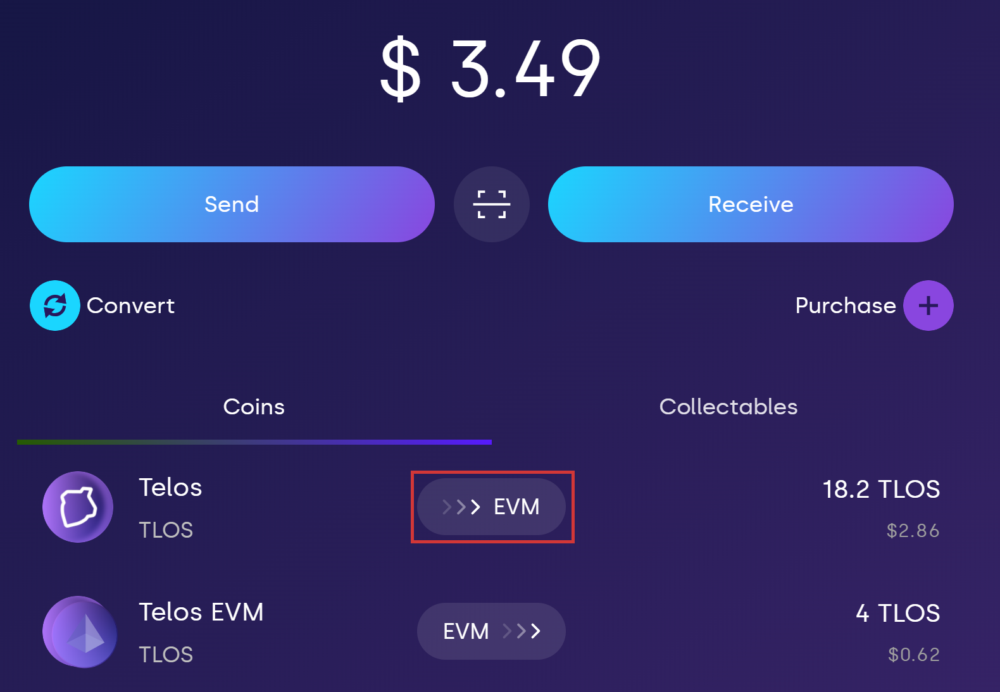
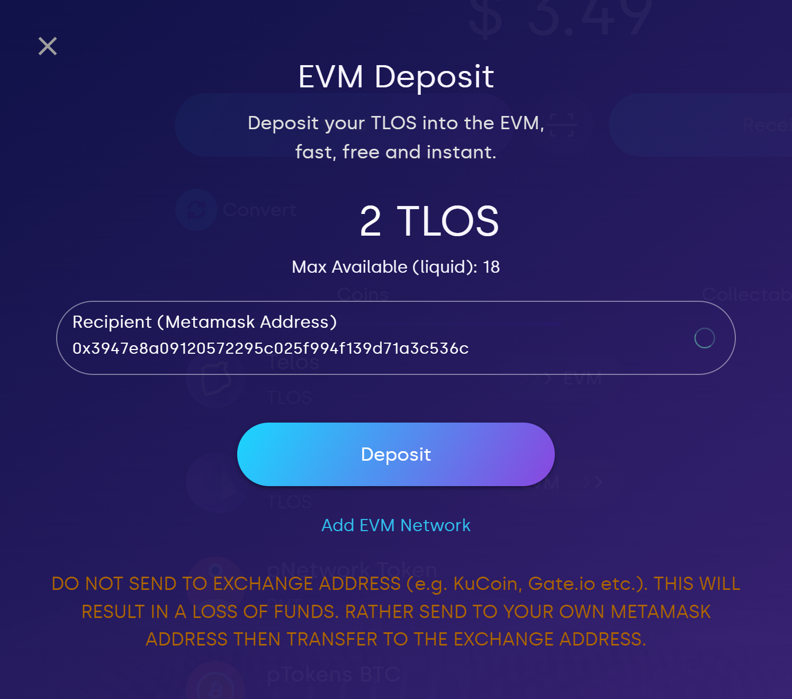
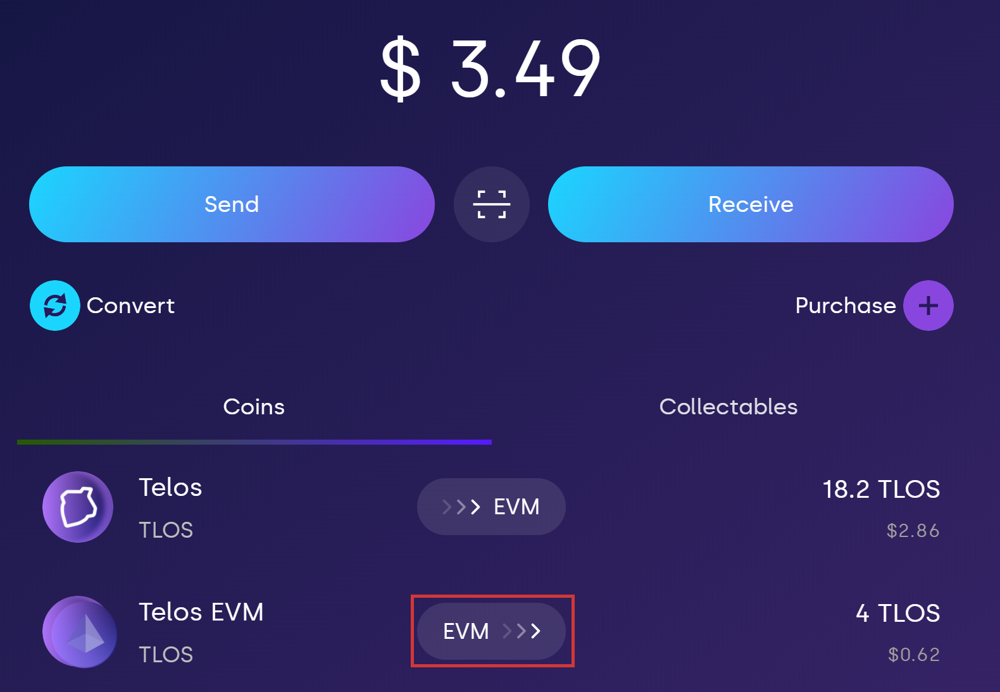
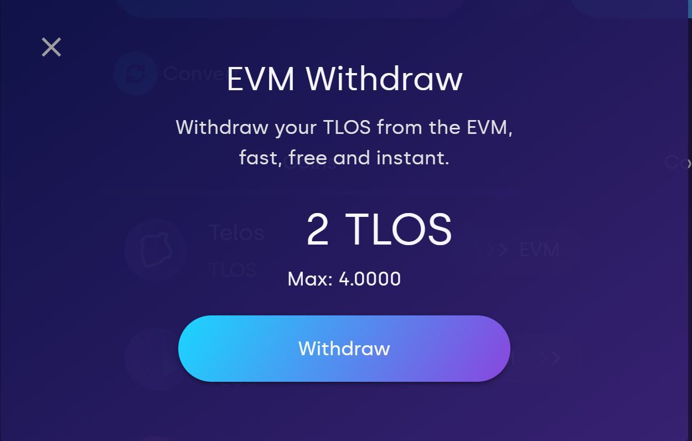
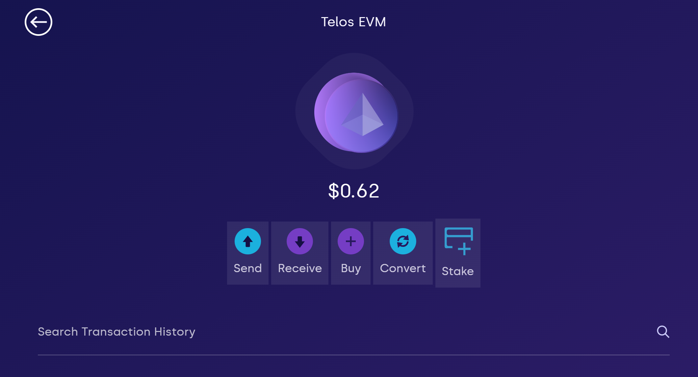
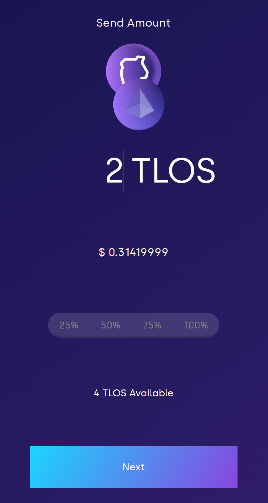
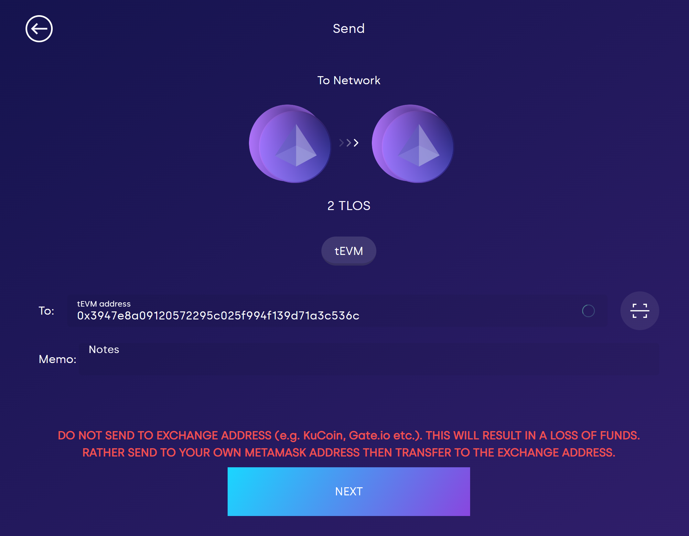
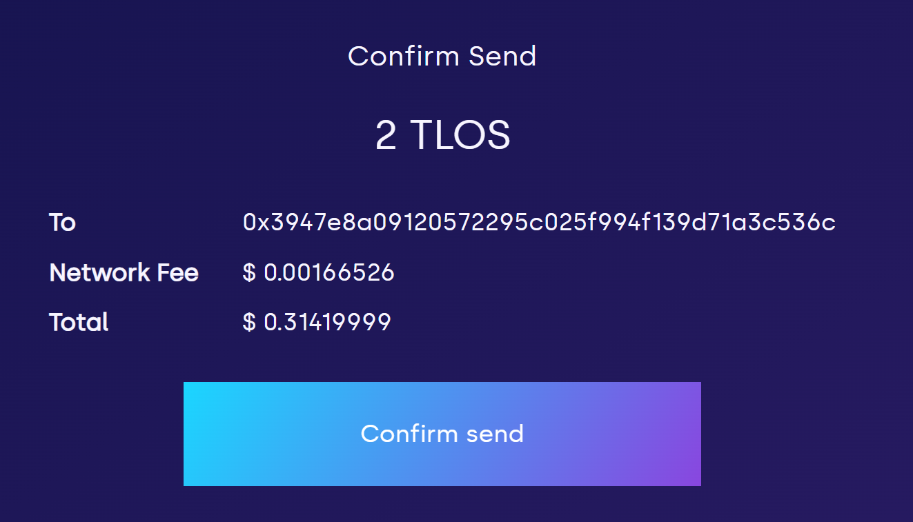

# Withdraw, Transfer, and Send TLOS

The tEVM uses TLOS Zero to pay for [gas](../../evm/about/gas-fees.md), which requires that you have TLOS on your EVM account to do transactions. To deposit TLOS to your EVM address, you need to transfer it from a Telos Zero account. TLOS can be purchased on the [web-wallet](https://wallet.telos.net) or through one of the official portals listed on [telos.net](https://telos.net).

To top-up an EVM testnet account, enter the address on the [Telos testnet faucet](https://app.telos.net/testnet/developers) and press the "Send Testnet EVM TLOS" button. 100 TLOS will be sent to that address.

## Withdrawing TLOS from exchanges to Telos EVM

If you currently have TLOS on [Gate.io](https://www.gate.io) or [KuCoin](https://www.kucoin.com), you can withdraw it to your EVM address by doing the following:

Make sure that the address and memo is:

**Address:** deposit.evm

**Memo:** (Your EVM address)

If not using Telos Wallet, users may want to use https://chainlist.org to connect TelosEVM using Metamask or an alternative web3 wallet/signer.

## Transferring TLOS from Telos Zero to EVM

After acquiring TLOS, you can send it to your EVM address using the [web-wallet](https://wallet.telos.net), which you can also use to send to other EVM addresses such as Metamask. Make sure you have [added the Telos EVM](./setting-up-wallets.md#telos-evm) network to your Metamask.

1. Once logged in to the [web-wallet](https://wallet.telos.net), click on the deposit to EVM button (as shown below).

2\. Enter the amount of TLOS you wish to deposit. Click "**Deposit**" and sign the transaction.&#x20;

3\. Viola! You should now see your new EVM balance.&#x20;

## Transferring TLOS from Telos EVM to Zero

Funds can also be transferred from your associated EVM address to your Telos account.

This can be done via the [web-wallet](https://wallet-dev.telos.net) by clicking on the EVM withdraw button to withdraw the desired amount.

1. Once logged in to the web-wallet, click on the transfer to Zero button (as shown below).

2\. Enter the amount of TLOS you wish to transfer. Click "Deposit" and sign the transaction.

## Sending TLOS to other EVM addresses with web wallet

Once you have TLOS on your EVM address, you can send it to any Metamask address using the web-wallet. This allows users to use dapps on the tEVM with their own wallet of choice.

1. On the web-wallet, click on the Telos EVM token.

2\. Click on "**Send**"

3\. Enter the amount you wish to send.

4\. Enter the address you wish to send to   .

5\. Confirm and sign the transaction.

